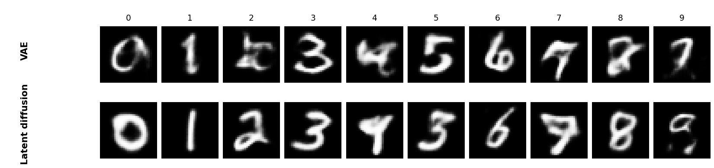
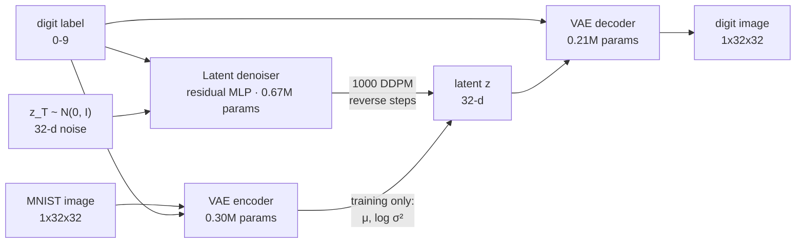
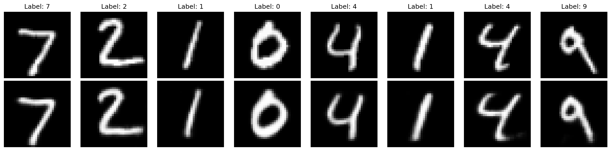
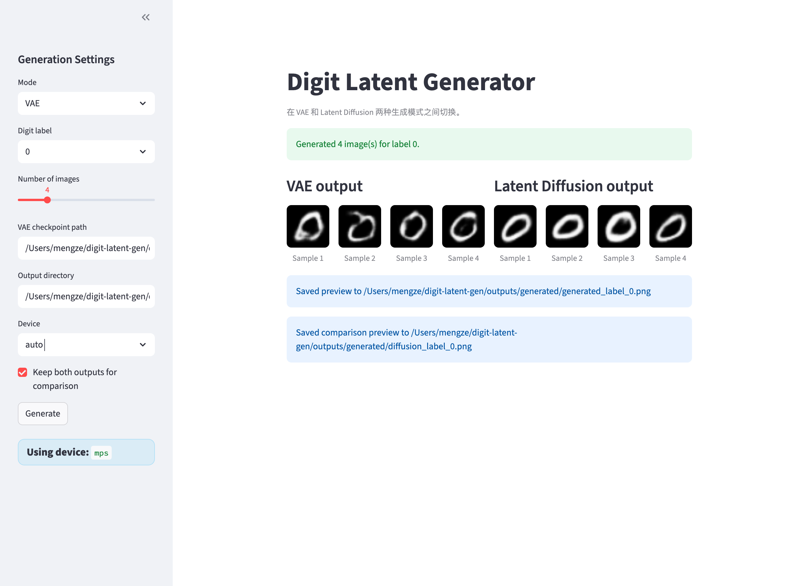

# Digit Latent Generation

[](https://github.com/mengze21/digit-latent-gen/actions/workflows/ci.yml)


Class-conditional MNIST generation with a **conditional VAE** and a **latent diffusion
model** that samples in the VAE's latent space. The repository covers the full path from
raw data to a running demo: model code, training and evaluation loops, a YAML config
system, inference APIs, a Streamlit UI, Docker images, and a CI pipeline that enforces
formatting, typing, and tests.



*One sample per class from each model, generated from checkpoints produced by the
training commands below (`torch.manual_seed(0)`). The diffusion row is sharper and
better separated by class; the VAE row is smoother and shows the blur typical of a
pixel-space L2 objective.*

## Highlights

**Modeling**

- **Two-stage generative pipeline.** The diffusion model never touches pixels: it
  denoises a 32-dimensional latent vector, which the VAE decoder turns into an image.
  Both stages are conditioned on the digit label, so generation runs from
  *label + noise → image*.
- **Conditional VAE** (0.51M params) that injects the label twice — as a channel-wise
  label map concatenated to the encoder input, and as an embedding concatenated to the
  latent before decoding. The same weights therefore serve reconstruction *and*
  class-conditional sampling.
- **DDPM latent denoiser** (0.67M params) with sinusoidal timestep embeddings, class
  embeddings, residual MLP blocks, and the standard noise-prediction (MSE) objective
  over a 1000-step linear schedule.

**Engineering**

- **Packaged, not scripted.** `src/` layout installed through `pyproject.toml` as
  `digit_latent_gen`, with dev extras — not a folder of loose scripts.
- **Config-driven.** Separate YAML configs per stage (model, paths, evaluation,
  generation) layered with command-line overrides, so a run is reproducible from its
  arguments — no paths or hyperparameters baked into the entrypoints.
- **11 pytest tests** covering layer-level and end-to-end tensor shapes, one real
  training epoch for each trainer, cosine LR scheduling, and device detection — plus
  `black` and `mypy` gates, all enforced in CI on every push and pull request.
- **Checkpoints that fail loudly.** The loader strips `module.` prefixes, checks key and
  shape compatibility, and rejects a diffusion checkpoint passed to the VAE generator
  instead of silently producing noise.
- **Portable by default.** Device auto-detection across MPS / CUDA / CPU, plus two Docker
  images: a CUDA training image and a slim, non-root Streamlit deployment image with
  mounted checkpoint and output volumes.

## How it works



| Component | Architecture | Parameters |
| --- | --- | --- |
| Conditional VAE | 2× `Conv2d(4×4, stride 2)` encoder → μ, log σ²; `ConvTranspose2d` decoder; label map (encoder) + label embedding (decoder) | 0.51M (0.30M enc / 0.21M dec) |
| Latent denoiser | 4 residual MLP blocks (hidden 128), 256-d sinusoidal time embedding, class embedding, linear β from 1e-4 to 2e-2, T = 1000 | 0.67M |

**Losses.** The VAE is trained with summed reconstruction MSE plus a KL term weighted by
`kl_weight` (0.1 in the default config), which keeps the latent space smooth enough for
the diffusion model to learn. The diffusion model is trained with the standard DDPM
objective: predict the noise added at a uniformly sampled timestep.

**Why latent diffusion.** Sampling in a 32-d latent space instead of 1024-d pixel space
means the denoiser stays small enough to train on a laptop, and the VAE supplies the
pixel-level detail — while the diffusion model only has to learn the *distribution* of
digit latents.

## Results

Numbers come from training and evaluation runs on Apple Silicon (MPS), with the settings
listed in each row.

| Stage | Setting | Metric | Value |
| --- | --- | --- | --- |
| Conditional VAE | 10 epochs · batch 32 · Adam 1e-3 | Test reconstruction MSE (per pixel) | **0.0042** (RMSE ≈ 0.065) |
| | | Test total loss (per sample) | 43.53 |
| | | Epoch 1 → 10 total loss | 18.39 → 8.27 |
| Latent diffusion | 40 epochs · batch 32 · Adam 1e-4 | Noise-prediction MSE (final epoch) | **0.216** |

The VAE numbers are computed on the full 10,000-image MNIST test set by
`python scripts/evaluate.py`; the diffusion number is the final-epoch training loss of
the 40-epoch run. `python scripts/evaluate_diffusion.py` reports the same objective on
the VAE-encoded test set once both checkpoints exist.



*Top row: MNIST test images. Bottom row: VAE reconstructions. Stroke placement and
digit identity are preserved; fine strokes are smoothed, as expected from an L2-trained
autoencoder.*

## Quickstart

```bash
git clone https://github.com/mengze21/digit-latent-gen.git
cd digit-latent-gen

pip install "torch==2.7.0" "torchvision==0.22.0"   # see pytorch.org for CUDA builds
pip install -e ".[dev]"
```

Train both stages on MNIST (downloaded automatically into `data/`). The diffusion stage
needs the VAE checkpoint produced by the first command:

```bash
python scripts/train_vae.py                # 10 epochs, the VAE config default
python scripts/train_diffusion.py --epochs 40
```

Generate digits:

```bash
python scripts/generate_vae.py --label 7 --num-samples 4
python scripts/generate_diffusion.py --label 7 --num-samples 4
```

Trained weights are written to `checkpoints/` and are not committed to the repository;
run the training commands above to produce them.

Every script accepts `--config`, `--device`, and overrides for the options it uses —
for example `python scripts/train_vae.py --epochs 20 --batch-size 64 --use-scheduler`.
Run any script with `--help` for the full list.

## Interactive demo

```bash
streamlit run streamlit_app.py
```

The UI switches between the VAE and latent diffusion modes, lets you pick a digit label,
sample count, checkpoint path, and device, and renders the results in the browser.



## Docker

A slim deployment image for the Streamlit app (CPU-only PyTorch, runs as a non-root
user, checkpoints and outputs mounted as volumes):

```bash
docker build -f docker/Dockerfile.streamlit -t digit-latent-gen-streamlit .
docker run --rm -p 8501:8501 \
  -v /path/to/checkpoints:/app/checkpoints \
  -v /path/to/outputs:/app/outputs \
  digit-latent-gen-streamlit
```

`docker/Dockerfile.gpu` builds a CUDA 12.6 training image from the official PyTorch
base image instead.

## Project layout

```text
digit-latent-gen/
├── src/digit_latent_gen/
│   ├── models/            # VAE and latent diffusion model definitions
│   ├── training/          # VAE and diffusion trainers (scheduler, grad clipping)
│   ├── inference/         # VAEGenerator / DiffusionGenerator: load, sample, save grids
│   └── common/            # MNIST dataset helpers and transforms
├── scripts/               # train / evaluate / generate entrypoints (argparse + YAML)
├── configs/               # vae_config.yaml, diffusion_config.yaml, generate_config.yaml
├── tests/                 # pytest suite (model shapes, trainers, devices)
├── docker/                # CUDA training image + Streamlit deployment image
├── docs/images/           # figures used in this README
└── streamlit_app.py       # interactive demo
```

## Quality checks

The same commands CI runs:

```bash
black --check src tests
mypy src
pytest tests/ -q
```

The test suite stays fast and dependency-light: it uses synthetic tensors and CPU-only
forward passes, so it runs in CI without downloading MNIST or requiring a GPU.

## Notes and next steps

Being explicit about what this project does and does not demonstrate yet:

- **Evaluation is loss-based only.** There is no FID, precision/recall, or
  classifier-based check that generated digits are actually recognizable as their
  requested class. That is the first thing to add before making any quality claim.
- **Samples are soft.** Thin strokes (1, 7) sometimes fragment. A convolutional or UNet
  denoiser, a longer schedule, or classifier-free guidance would sharpen them; the
  current MLP denoiser was chosen to keep training feasible on a laptop.
- **The VAE run is short.** 10 epochs with a fixed KL weight; β-annealing and a longer
  schedule would improve reconstructions and give the diffusion stage cleaner latents.
- **Training metrics go to stdout and a log file.** TensorBoard logging is not wired up.
- **The checkpoint-loading paths are untested.** The generator's compatibility checks and
  the save/load round trip are exercised by hand, not by pytest — the obvious next tests
  to add (`tests/test_model_io.py` currently covers model shapes rather than I/O, so the
  name is aspirational).
- **Known gap:** `scripts/train_diffusion.py` reads its hyperparameters from CLI flags and
  their defaults, not from the `training:` block in `configs/diffusion_config.yaml`
  (the script looks for a legacy `diffusion:` key). The diffusion results above were
  produced with explicit flags for that reason; wiring the block up is a one-line fix.

## License

MIT — see [LICENSE](LICENSE).

---

Built by [mengze21](https://github.com/mengze21). If you would like to talk about the
implementation, open an issue or reach out via GitHub.
